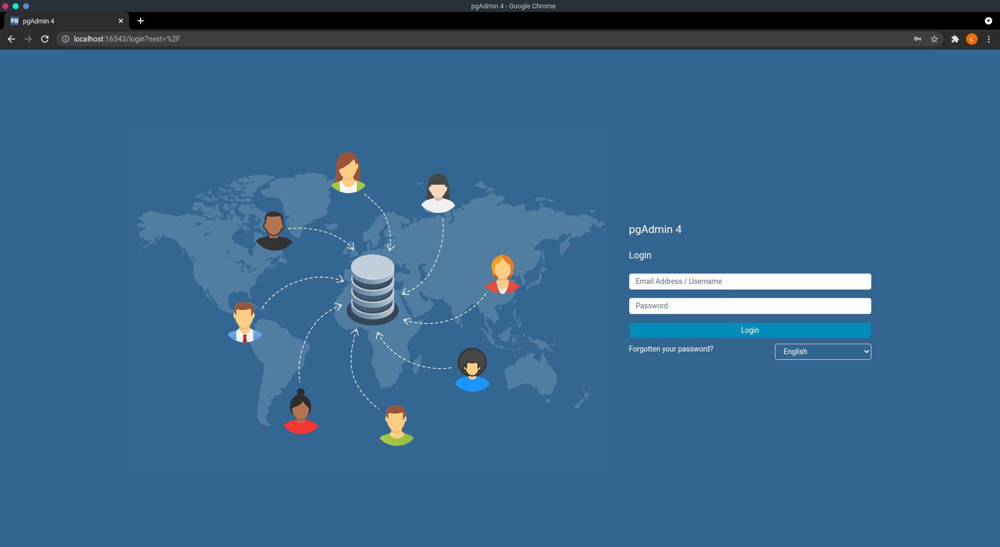
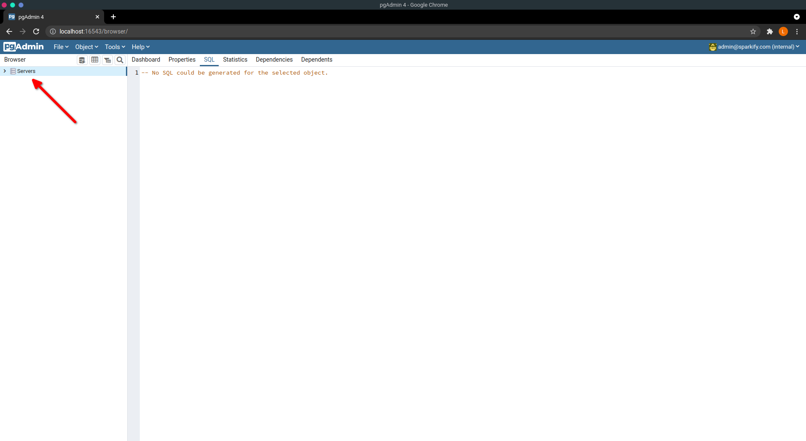
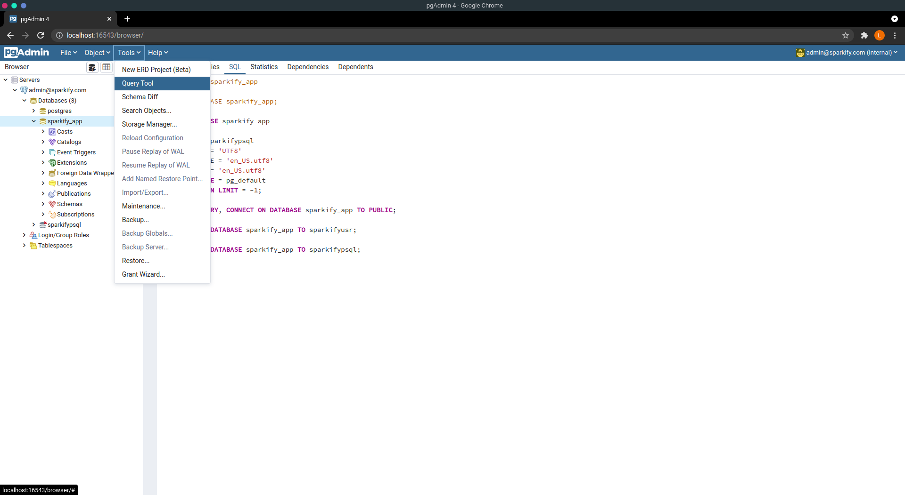
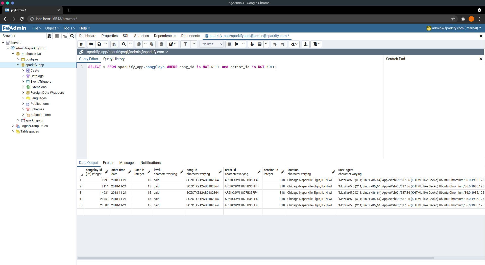
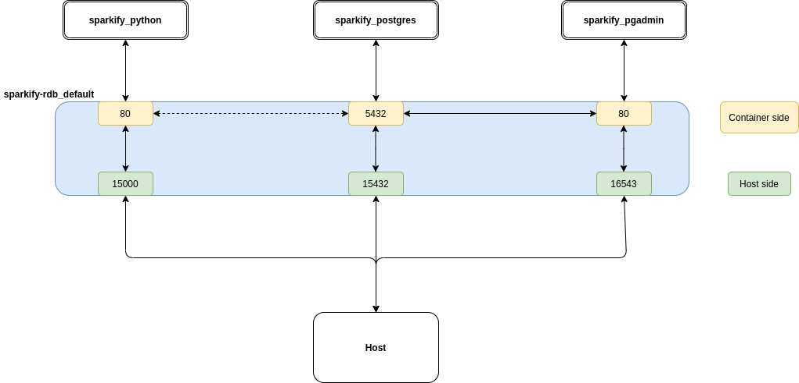

<p align="center">
  <a href="" rel="noopener">
 </a>
</p>

<h3 align="center"> <i>Songplays</i> User activity datamart </i></h3>


<div align="center">

[]() [](https://github.com/lkkellermann/sparkify-rdb/issues) [](https://github.com/lkellermann/sparkify-rdb/pulls) [](/LICENSE)

</div>


---

<p align="center"> The following document describes the model used to build the <i>songplays</i> datamart table and the respective ETL process.
    <br> 
</p>

## **Table of Contents**

- [About](#about)
- [Getting Started](#getting_started)
- [Data Model and Schema](#data_model)
- [Deployment](#deployment)
- [Built Using](#built_using)
- [Authors](#authors)


## **About** <a name = "about"></a>
The `songplays` datamart provide details about the musical taste of our customers and can help us to improve our recomendation system. 

This document describes the model of `songplays` table datamart on `sparkify_app` schema inside a container `sparkify_postgres`, and the Python code to load new data. The production directory and data must be simmilar to those in `mnt/data/log_data` and `mnt/data/song_data` paths in this repository.

## 🏁 **Getting Started** <a name = "getting_started"></a>
First you need to have the right permissions to access the source files and write them into `sparkify_app` tables that generates the `songplays` datamart table. Contact the owners or your team leader for more information.

## **Data Model and Schema** <a name = "data_model"> </a>
---


**Source files and owners**
| File or table          | Description                                                | Directory                 | Owner    |
| ---------------------- | ---------------------------------------------------------- | ------------------------- | -------- |
| YYYY-MM-DD-events.json | User events.                                               | mnt/data/log_data/YYYY/11 | Person 1 |
| <random_tag>.json      | Song data.                                                 | mnt/data/song_data/a      | Person 2 |
| `songplays`            | Datamart for recomendation system.                         | `sparkify_app.songplays`  | Person 3 |
| `artists`              | Dimension table for artists.                               | `sparkify_app.artists`    | Person 1 |
| `songs`                | Dimension table for songs.                                 | `sparkify_app.songs`      | Person 1 |
| `time`                 | Dimension table for streaming start time for a given song. | `sparkify_app.time`       | Person 2 |
| `users`                | Dimension table for users.                                 | `sparkify_app.users`      | Person 3 |

## **Prerequisites**
---
To run this project first you need to install the [Docker Engine](https://docs.docker.com/engine/) for your operational system and [Docker Compose](https://docs.docker.com/compose/install/).

After installing and configuring the Docker tools, download this repository and create a folder named `postgres` that will store all `sparkify_postgres` service data. To build the proper images and run the services, just execute the following command inside this repository:
```shell
docker-compose up
```
If the service runs successfully you should see something like this:
```shell
...
sparkify_python      | 28/30 files processed.
sparkify_python      | 29/30 files processed.
sparkify_python      | 30/30 files processed.
sparkify_python exited with code 0
```
You can also check the job by following these steps:

- Open your browser and access `localhost:16543`:

  - Enter with the following credentials to authenticate:
    - *e-mail*: `admin@sparkify.com`
    - *password*: `sp4rk1fy`
- After you log in, click on the `Servers` option at the upper corner on the left:

  - You will be asked to enter with the PostgreSQL credentials:
    - *User*: `sparkifypsql`
    - *Password*: `p4ssw0rd`

- Select the `Query Tools` under the `Tools` menu:
   

- Under the `Query Editor`, run the following query:
  ```sql
  SELECT * FROM sparkify_app.songplays WHERE song_id is NOT NULL and artist_id is NOT NULL;
  ```
  - You should get only 5 rows.
 
## **Microservice architecture** <a name = "deployment"></a>
The following image represents the microservice architecture for this project:


Where:
- `sparkify_python`: runs all Python scripts and stores raw data.
- `sparkify_postgres`: runs Postgre and stores the database.
- `sparkify_pgadmin`: runs the pgAdmin tool to monitor the `sparkify_postgres` service.
## ⛏️ Built Using <a name = "built_using"></a>


- [Dbeaver](https://dbeaver.io/) - Database tool.
- [Docker Compose](https://docs.docker.com/compose/install/) - Tool to run multi-container applications.
- [Docker Engine](https://docs.docker.com/engine/) - Container engine.
- [pandas](https://pandas.pydata.org/) - Data analysis and data wrangling tool.
- [pgAdmin](https://www.pgadmin.org/) - PostgreSQL tool. 
- [psycopg2](https://pypi.org/project/psycopg2/) - Database adapter for Python.
- [PostgreSQL](https://www.postgresql.org/) - Reletional database management system.


## ✍️ Authors <a name = "authors"></a>

- [@lkellermann](https://github.com/lkellermann) - Idea & Initial work
