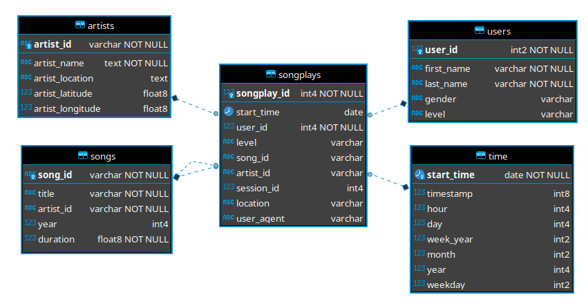

<p align="center">
  <a href="" rel="noopener">
 </a>
</p>

<h3 align="center">User activity datamart <i>songplays</i></h3>

<div align="center">

[]()
[](https://github.com/kylelobo/The-Documentation-Compendium/pulls)
[](/LICENSE)
</div>

---

<p align="center"> The following document describes the model used to build the <i>songplays</i> datamart table and the respective ETL process.
    <br> 
</p>

## **Table of Contents**

- [About](#about)
- [Getting Started](#getting_started)
- [Data Model and Schema](#data_model)
- [Deployment](#deployment)
- [Usage](#usage)
- [Built Using](#built_using)
- [Authors](#authors)


## **About** <a name = "about"></a>
The `songplays` datamart can give us details about the musical taste of our customers and can help us to improve our recomendation system. 

This document describes the model of `songplays` table datamart on `sparkifydb` at server `localhost`, and the Python code to load new data. The production directory and data must be simmilar to those in `data/log_data` and `data/song_data` paths in this repository.

## 🏁 **Getting Started** <a name = "getting_started"></a>
First you need to have the right permissions to access the source files and write them into `sparkifydb` tables that generates the `songplays` datamart table. Contact the owners or your team leader for more information.

## **Data Model and Schema** <a name = "data_model"> </a>
---



**Source files and owners**
| File or table| Description | Directory | Owner |
| ---- | --------- | ---- | ----- |
| YYYY-MM-DD-events.json| User events.| data/log_data/YYYY/11| Person 1|
| <random_tag>.json| Song data.| data/song_data/a | Person 2|
|`songplays`| Datamart for recomendation system. | `sparkifydb.songplays`| Person 3
| `artists`| Dimension table for artists.| `sparkifydb.artists`| Person 1|
| `songs`| Dimension table for songs.| `sparkifydb.songs`| Person 1|
|`time`| Dimension table for streaming start time for a given song. | `sparkifydb.time` | Person 2|
|`users`| Dimension table for users. | `sparkifydb.users` | Person 3|

## **Prerequisites**
---
To run the `etl.py` script you need to install [Postgresql](https://www.postgresql.org/download/) and [Python](https://www.python.org/downloads/).

After installing Python, you should [create a virtual environment](https://docs.python.org/3/library/venv.html) and install the packages listed on `requirements.txt` file by running the following command:

```Shell
pip install -f requirements.txt
```

## **Usage** <a name="usage"></a>

Followed the steps above you should be able to run the workloads by runnig the `etl.py` script.

## **Deployment** <a name = "deployment"></a>
Look for the appropriate instructions to setup the task scheduler for the workloads. These workloads will depend on the deployment operational system and the business rules. 

## ⛏️ Built Using <a name = "built_using"></a>

- [PostgreSQL](https://www.postgresql.org/) - Database
- [psycopg2](https://pypi.org/project/psycopg2/) - Database adapter for Python.
- [pandas](https://pandas.pydata.org/) - Data analysis and data wrangling tool.

## ✍️ Authors <a name = "authors"></a>

- [@kellermann92](https://github.com/kellermann92) - Idea & Initial work
